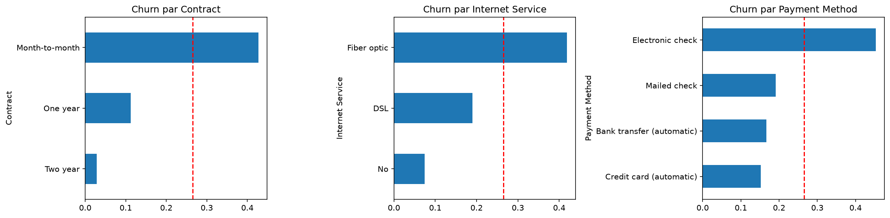
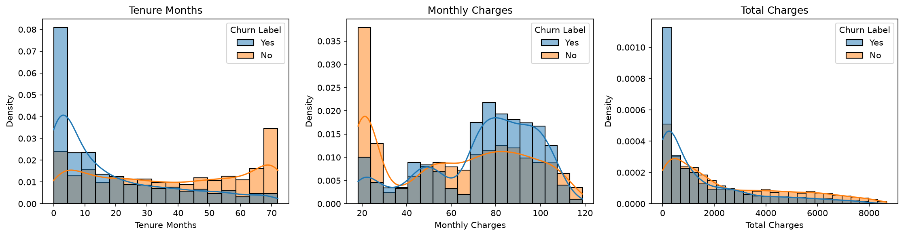

# Prédiction du churn client (Telco)

> Identifier à l'avance les clients d'un opérateur télécom qui risquent de résilier, comprendre pourquoi, et décider à qui proposer une offre de rétention pour maximiser le gain financier.

## 1. Problématique

Acquérir un client coûte plus cher que d'en garder un. Le projet répond à trois questions :

1. **Prédire** : quels clients vont partir ? (classification binaire)
2. **Expliquer** : quels facteurs poussent au départ ? (SHAP)
3. **Décider** : à qui proposer une offre, sachant qu'elle a un coût ? (seuil basé sur le coût)

## 2. Données

- **Source** : Telco Customer Churn (IBM, version Cognos), [lien Kaggle à ajouter], licence : [à vérifier]
- **Taille** : 7 043 clients, 33 colonnes, fichier `.xlsx` à placer dans `data/Telco_customer_churn.xlsx`
- **Cible** : `Churn Value` (0/1), environ 26,5 % de départs (classes déséquilibrées)
- **Colonnes exclues** : `Churn Score`, `CLTV`, `Churn Reason` (fuite de données) ; identifiants et colonnes géographiques (sans valeur prédictive)

## 3. Méthodologie

1. Analyse exploratoire : [`notebooks/01_eda.ipynb`](notebooks/01_eda.ipynb)
2. Préparation : découpage train/test stratifié, puis encodage et transformations ajustés sur le train uniquement
3. Modélisation : régression logistique (baseline), Random Forest, XGBoost, comparés par validation croisée stratifiée
4. Évaluation : recall, precision, PR-AUC (pas l'accuracy seule)
5. Explicabilité (SHAP) et seuil de décision basé sur le coût métier

## 4. Principaux enseignements de l'EDA

- **Classes déséquilibrées** : 26,5 % de churn, donc évaluation par recall et PR-AUC.
- **Le risque est concentré au début** : 47,4 % de churn la première année contre 9,5 % après 4 ans.
- **Le contrat est le signal le plus fort** : 42,7 % de churn en contrat mensuel contre 2,8 % sur 2 ans.
- **Autres profils à risque** : chèque électronique (45,3 %), fibre optique (41,9 %), absence de support technique ou de sécurité en ligne (environ 42 %).
- **Le prix seul n'explique pas le churn** : les partis paient plus cher en global, mais à type d'internet égal ils ne paient pas plus (effet de composition, paradoxe de Simpson).
- **Qualité des données** : aucun doublon ; les 11 valeurs manquantes de `Total Charges` sont des clients à 0 mois d'ancienneté, remplacées par 0.
- **Redondance** : `Total Charges` est très corrélée à `Tenure Months` (0,83).




> Ces résultats sont des associations, pas des relations de cause à effet. Détails complets dans le notebook.

## 5. Résultats de la modélisation

| Modèle | Recall | Precision | PR-AUC |
|--------|--------|-----------|--------|
| Régression logistique | [ ] | [ ] | [ ] |
| Random Forest | [ ] | [ ] | [ ] |
| XGBoost | [ ] | [ ] | [ ] |

**Principaux facteurs (SHAP)** : [à compléter]

**Impact métier** : avec un coût de [500] par client perdu et [50] par offre, le seuil optimal est [ ], pour un gain estimé de [ ].

## 6. Recommandations métier

- [À compléter après la modélisation]

## 7. Reproduction

```bash
git clone https://github.com/[ton-pseudo]/churn-prediction.git
cd churn-prediction
python -m venv venv
venv\Scripts\activate          # Windows
pip install -r requirements.txt
jupyter notebook
```

## 8. Limites

- Dataset fictif de taille modérée, sans dimension temporelle ni données d'usage : résultats non transposables tels quels à une entreprise réelle
- Analyse basée sur des associations, sans test statistique ni preuve de causalité
- Variables sensibles (`Gender`, `Senior Citizen`) : leur usage pour cibler des offres pose une question d'équité

## Auteur

**HASSNA LAHDILI** : [lien LinkedIn] | hassna.hlahdili@gmail.com